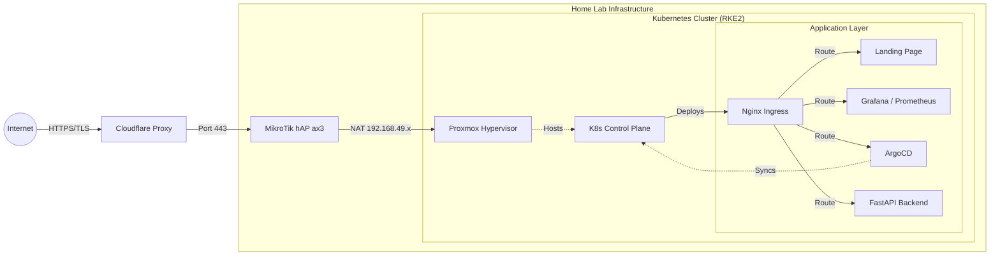

# Homelab
My Homelab & Kubernetes Platform

## Overview
Welcome to my homelab! I'm documenting my learning experience transitioning from traditional networking and virtualisation to a modern, cloud-native Kubernetes platform.

### About Me
I'm an Operations Engineer at Superloop  (**ASX: SLC**) a challenger telecommunications provider in Australia. I focus on implementing Modern Observability stacks and maintaining high levels of network and platform availability.

### Current Goals
The primary goal of this lab is to simulate a production-grade microservices environment with GitOps, High Availability and Modern Observability (while keeping power and noise to a minimum). 
All applications in this repository are pushed automatically by ArgoCD.

- [x] GitOps Implementation: Migrate manual installs to ArgoCD applications
- [x] Modern Observability: Implement Prometheus, InfluxDB and Loki with Grafana for cluster and network monitoring and logging
- [x] Ingress & TLS: Automate Let's Encrypt certificates via cert-manager and CloudFlare
- [ ] Custom Operators: Develop a custom Go operator to manage lab resources
- [x] Back-end & API: Build out a website back-end database and queriable API

---
## Architecture
Traffic enters the cluster via Cloudflare Proxy, which is forwarded from my MikroTik home router to the Kubernetes Nginx Ingress Controller (running in `HostNetwork` mode for bare-metal performance).

### Compute:
**Intel NUC (NUC7i5DNHE)**
* CPU: Intel i5-7300 2.60 GHz CPU (4 Core)
* RAM: 8GB DDR4 RAM
* Role: 1 x RKE2 Master Node & 2 x RKE2 Worker Node

**Raspberry Pi 4**
* CPU: Broadcom BCM2711 1.80 GHz CPU (4 Core)
* RAM: 4GB DDR4 RAM
* Role: 1 x RKE2 Worker Node

### Dashboards
**Custom-built dashboard to access internal services, deployed via Docker & k8s**
https://joshdarcy.xyz

### Observability (Grafana)
**Real-time Proxmox Monitoring**

**Real-time VM Monitoring**

**Real-time Cluster Monitoring**

